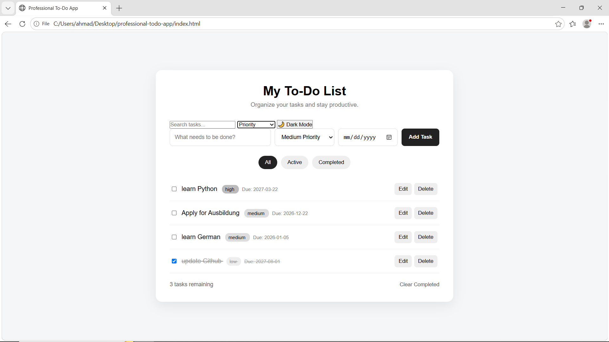

# Professional To-Do App
[](https://ahmadreza7577.github.io/professional-todo-app/)
[](https://github.com/Ahmadreza7577/professional-todo-app)

A modern and responsive To-Do application built with **HTML, CSS, and Vanilla JavaScript**.
It provides a clean interface for managing daily tasks with priorities, due dates, search, filtering, dark mode, and persistent local storage.

## ✨ Features

* ✅ Create, complete, and delete tasks
* ⭐ Set task priorities
* 📅 Add due dates
* 🔍 Search tasks instantly
* 🏷️ Filter tasks by status and priority
* 🌙 Dark mode
* 💾 Persistent data using Local Storage
* 📱 Responsive design for desktop and mobile
* 🎨 Clean and modern user interface
* ⚡ No frameworks or external dependencies

## 🖼️ Screenshot



<!-- Replace the section above with the following after adding your screenshot:

-->

## 🛠️ Tech Stack

* **HTML5** — Application structure
* **CSS3** — Styling, layout, responsiveness, and dark mode
* **JavaScript (ES6+)** — Application logic and task management
* **Local Storage API** — Persistent task data

## 📂 Project Structure

```text
professional-todo-app/
│
├── index.html
├── style.css
├── script.js
├── README.md
└── screenshots/
    └── todo-app.png
```

## 🚀 Getting Started

### 1. Clone the repository

```bash
git clone https://github.com/Ahmadreza7577/professional-todo-app.git
```

### 2. Open the project

Navigate to the project directory:

```bash
cd professional-todo-app
```

### 3. Run the application

Open `index.html` directly in your browser.

No build tools, package managers, or additional dependencies are required.

## 💡 How It Works

Tasks are managed entirely on the client side using JavaScript.

Your tasks are stored in the browser's **Local Storage**, which means your data remains available after refreshing or reopening the application on the same browser.

## 🌐 Live Demo

🚀 **[View Live Demo](https://ahmadreza7577.github.io/professional-todo-app/)**

## 📂 Repository

💻 **[View Source Code on GitHub](https://github.com/Ahmadreza7577/professional-todo-app)**

Once GitHub Pages is enabled:

```text
https://ahmadreza7577.github.io/professional-todo-app/
```

## 📌 Future Improvements

Some possible improvements for future versions:

* [ ] Drag & drop task ordering
* [ ] Task editing
* [ ] Categories and tags
* [ ] Task statistics and analytics
* [ ] Export and import tasks
* [ ] Cloud synchronization
* [ ] User authentication

## 👨‍💻 Author

**Ahmadreza**

GitHub:
https://github.com/Ahmadreza7577

---

⭐ If you find this project useful, consider giving it a star on GitHub.
